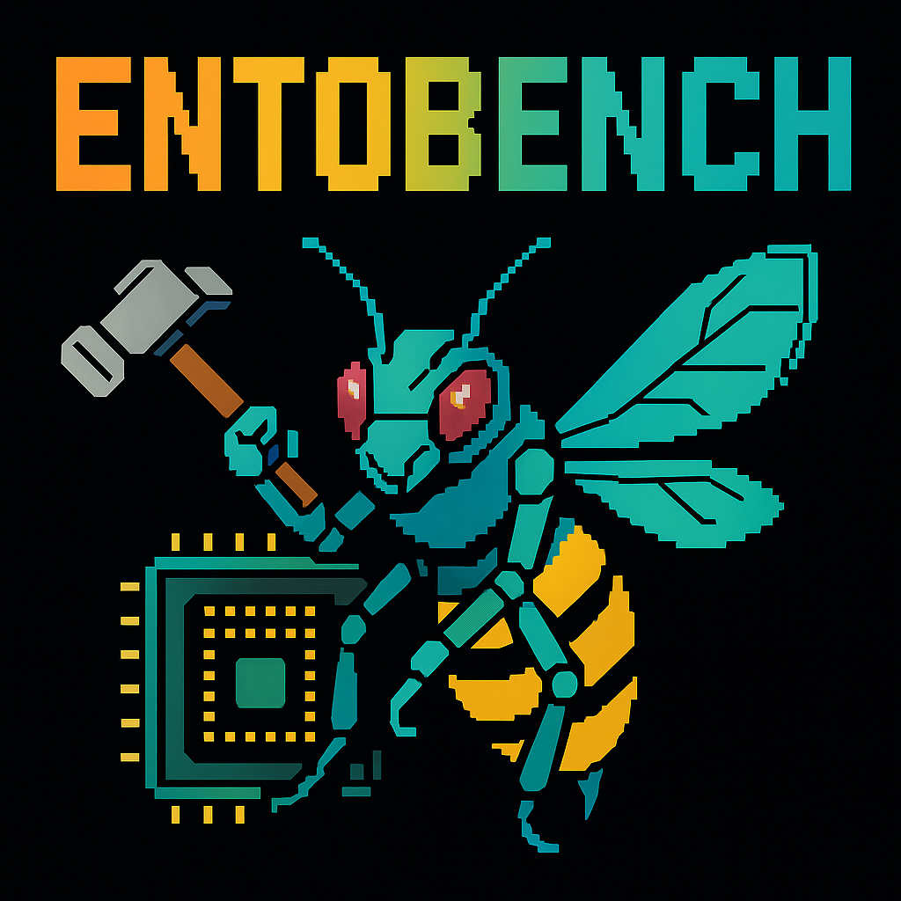

<div align="center">
  <h1>Ento-Bench: A Benchmarking Framework for Computer Vision and State Estimation on Embedded Systems</h1>
  
  
  
  [](https://github.com/derinozturk/ento-bench/actions/workflows/tests.yml)
  [](https://github.com/derinozturk/ento-bench/actions/workflows/build.yml)
  [](https://www.st.com/en/microcontrollers-microprocessors.html)
  [](https://cmake.org/)
</div>

Ento-Bench is a comprehensive benchmarking framework designed for evaluating computer vision and state estimation algorithms on embedded systems, particularly STM32 microcontrollers. The framework provides a flexible harness for running benchmarks with different configurations and measuring performance metrics.

## Features

- Support for multiple build targets:
  - Native (x86/ARM64)
  - STM32 microcontrollers (with semihosting support)
  - gem5 simulation
- Comprehensive benchmarking harness with configurable metrics
- Dataset-driven benchmarking with configurable input/output paths
- Performance measurement tools for embedded systems

## Prerequisites

### Required Tools

1. **CMake** (version 3.16 or higher)
2. **GCC/G++** (version 14 or higher) or **Clang**
3. **OpenOCD** (for STM32 flashing and debugging)
4. **ARM GNU Embedded Toolchain** (arm-none-eabi-gcc)
5. **ST Cube MonitorPower** (for energy measurements) - [Download here](https://www.st.com/en/development-tools/stm32cubemonpwr.html#documentation)

> **Note**: For energy measurements, you'll need an ST-Link V3PWR debug probe. This specialized hardware allows for accurate power consumption monitoring during benchmark execution.

### Installing Dependencies

#### macOS
```bash
# Install CMake
brew install cmake

# Install OpenOCD (specific version for STM32 support with semihosting and stlink-v3pwr)
git clone https://git.code.sf.net/p/openocd/code openocd
cd openocd
git checkout bc9ca5f4a
./bootstrap
./configure
sudo make -j16
sudo make install

# Set OpenOCD environment variables
echo 'export OPENOCD_HOME="/usr/local/share/openocd/scripts"' >> ~/.zshrc
echo 'export OPENOCD_PATH="/usr/local/share/openocd/scripts"' >> ~/.zshrc
source ~/.zshrc

# Install ARM Toolchain
# Download from ARM website: https://developer.arm.com/tools-and-software/open-source-software/developer-tools/gnu-toolchain/downloads
# Extract to /usr/local/arm-none-eabi-gcc
```

#### Ubuntu/Debian
```bash
# Install CMake
sudo apt-get install cmake

# Install OpenOCD (specific version for STM32 support with semihosting and stlink-v3pwr)
git clone https://git.code.sf.net/p/openocd/code openocd
cd openocd
git checkout bc9ca5f4a
./bootstrap
./configure
sudo make -j16
sudo make install

# Set OpenOCD environment variables
echo 'export OPENOCD_HOME="/usr/local/share/openocd/scripts"' >> ~/.bashrc
echo 'export OPENOCD_PATH="/usr/local/share/openocd/scripts"' >> ~/.bashrc
source ~/.bashrc

# Install ARM Toolchain
# Download from ARM website: https://developer.arm.com/tools-and-software/open-source-software/developer-tools/gnu-toolchain/downloads
# Extract to /usr/local/arm-none-eabi-gcc
```

## Building the Project

### Native Build

1. Create a build directory:
```bash
mkdir build && cd build
```

2. Configure CMake for native build:
```bash
cmake .. -DCMAKE_BUILD_TYPE=Release
```

3. Build the project:
```bash
make -j$(nproc)
```

### STM32 Build with Semihosting

1. Create a build directory:
```bash
mkdir build && cd build
```

2. Configure CMake for STM32 build. The configuration depends on your target board:
```bash
# Example for STM32G474RE
cmake -DCMAKE_TOOLCHAIN_FILE=../../stm32-cmake/stm32-g474re.cmake \
      -DFETCH_ST_SOURCES=True \
      -DOPENOCD_CFG=semihosting_stm32g4.cfg \
      -DLATENCY_MEASUREMENT=1 \
      ../..
```

> **Note**: 
> - Change the toolchain file (`stm32-*.cmake`) and OpenOCD config based on your target board
> - `LATENCY_MEASUREMENT=1` is optional and only needed for energy measurements
> - The family name in the toolchain file should match your target board (e.g., G4, H7, etc.)

3. Build the project:
```bash
make -j$(nproc)
```

4. Flash and debug using OpenOCD:
```bash
# Flash the binary
make stm32-flash-<target-name>-semihosted

# Start debug session
make stm32-debug-<target-name>-semihosted
```

## Project Structure

- `src/`: Core source code
  - `ento-bench/`: Benchmarking framework
  - `ento-feature2d/`: Feature detection, feature description, feature matching, and optical flow algorithms
  - `ento-pose/`: Pose estimation algorithms
  - `ento-control/`: Control algorithms
  - `ento-mcu/`: MCU-specific utilities
  - `ento-util/`: General utilities
  - `ento-math/`: General math utilities
  - `image_io/`: Image utilities (will move to ento-image soon...)
- `benchmark/`: Benchmark implementations
  - `perception/`: Computer vision benchmarks
  - `state-est/`: State estimation benchmarks
  - `ubmark/`: Microbenchmarks
- `stm32-cmake/`: STM32-specific CMake configurations

## Running Benchmarks

### Native Benchmarks

> **Note**: Native benchmarking support is currently limited. While the framework can be built and run natively, we do not yet support performance measurement tools like `perf`. This functionality may be added in a future update.

```bash
# Build for native execution
cmake .. -DCMAKE_BUILD_TYPE=Release
make -j$(nproc)

# Run a specific benchmark
./bin/<benchmark-name>
```

### STM32 Benchmarks

1. Connect your STM32 board via ST-Link
2. Flash the benchmark:
```bash
make stm32-flash-<benchmark-name>-semihosted
```
3. Monitor the output through semihosting

### gem5 Simulation (Limited Support)

> **Note**: gem5 simulation support is currently limited and experimental. More robust support will be added in a future update.

1. Build for gem5 simulation:
```bash
cmake .. -DGEM5_BUILD=ON
make -j$(nproc)
```

2. Run the benchmark in gem5:
```bash
# Example command (specific parameters may vary)
gem5/build/ARM/gem5.opt configs/example/se.py --cpu-type=MinorCPU --caches --cmd=./bin/<benchmark-name>
```


