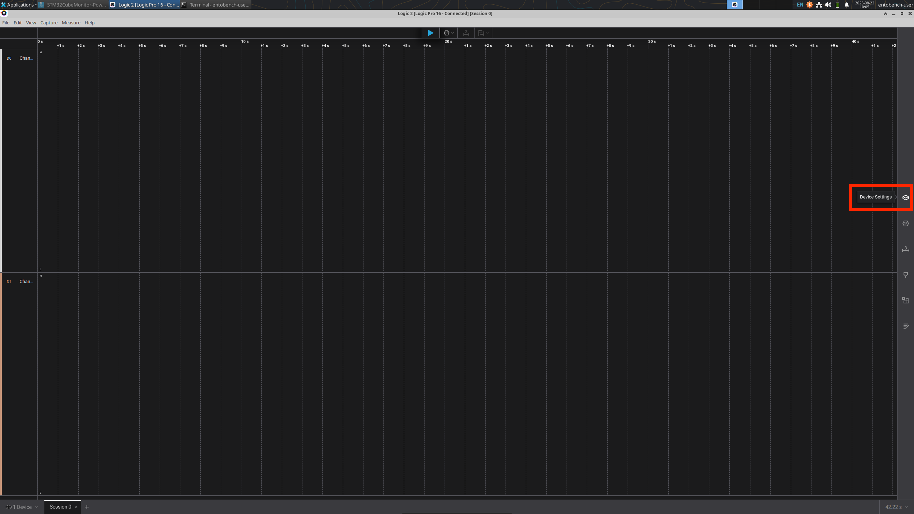
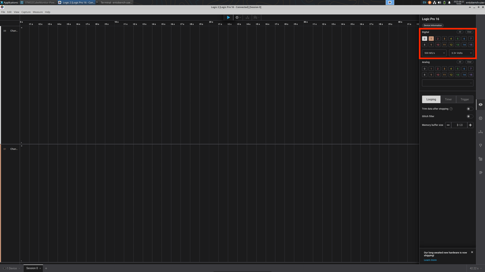
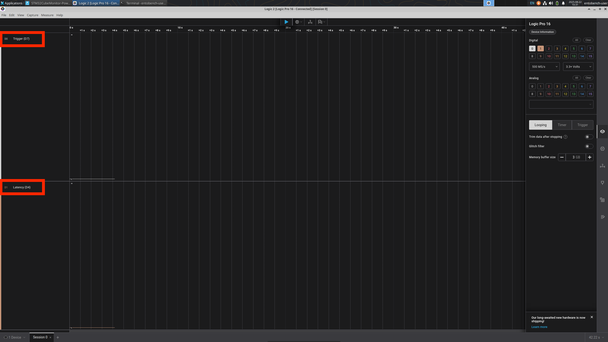
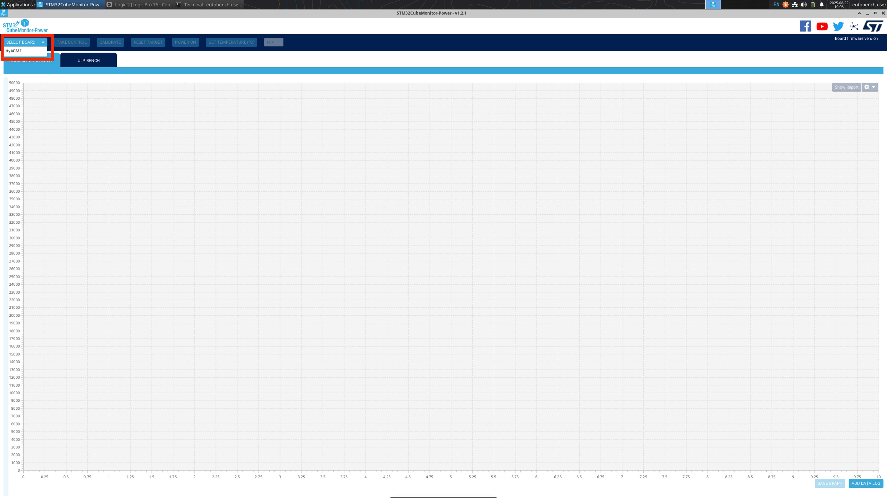
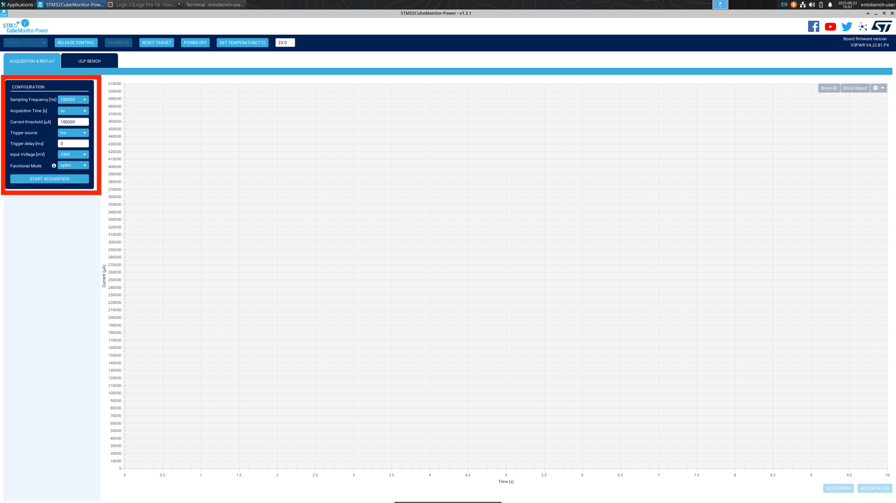

# GUI Setup Guide for Power + Signal Measurement

This guide shows how to set up **Logic 2** and **STM32CubeMonitor-Power** for Artifact Evaluation.  
We assume you have already installed both applications.

---

## 1. Setting up Logic 2

Logic 2 is used to capture GPIO signals from the microcontroller during benchmark runs.

1. **Launch Logic 2**  
   

2. **Select the device and open settings**  
   Choose your connected Saleae Logic device.  
   

3. **Rename the signal channels**  
   Rename GPIO channels to match the expected benchmark signals (e.g., `TRIGGER`, `DONE`).  
   

---

## 2. Setting up STM32CubeMonitor-Power

STM32CubeMonitor-Power (CMP) is used to measure current draw from the STLink-V3PWR board.

1. **Select the STLink-V3PWR board**  
   Choose the board from the device selection screen.  
   

2. **Configure the measurement channels**  
   Adjust the CMP configuration to enable the relevant rails and set sampling options.  
   

---

## 3. Ready to Use

With Logic 2 and STM32CubeMonitor-Power configured:
- **Logic 2** will record signal transitions for benchmarking.
- **CMP** will capture power measurements during runs.

Proceed to the experiment workflow instructions in the main README.
