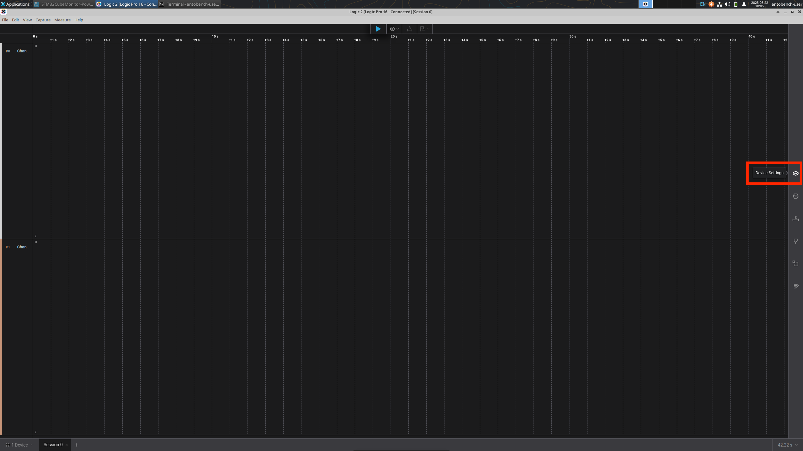
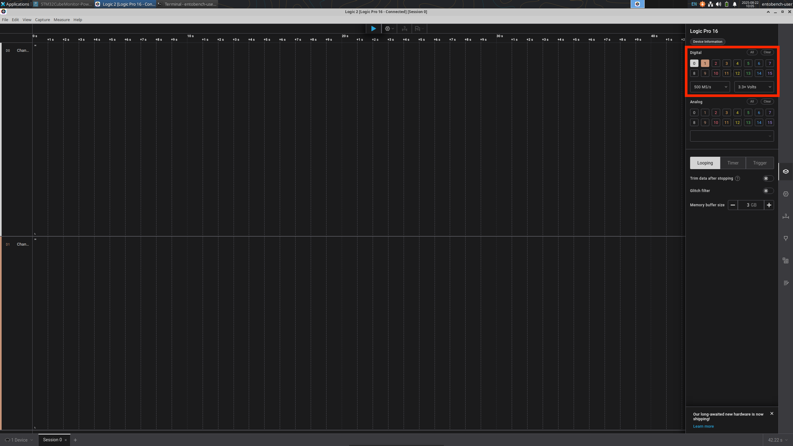
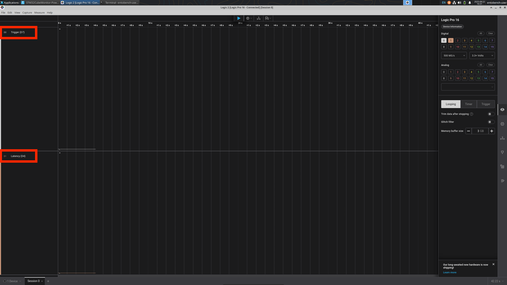
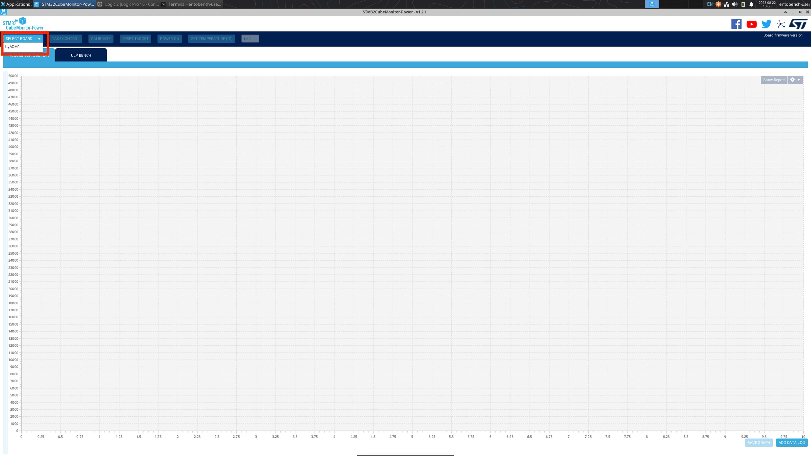
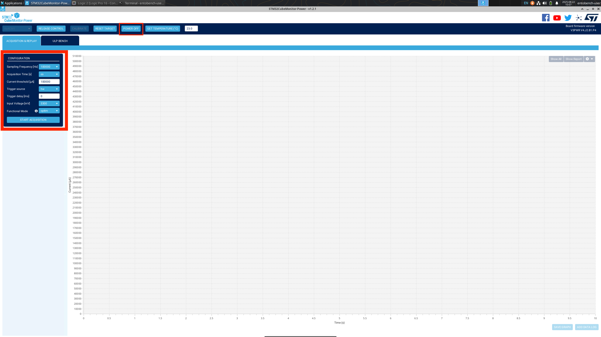

# GUI Setup Guide for Power + Signal Measurement

This guide shows how to set up **Logic 2** and **STM32CubeMonitor-Power** for Artifact Evaluation.  
We assume you have already installed both applications and have wired up the logic analyzer, current
probe+programmer and microcontroller under test as shown in the provided hardware-setup-guide.

---

## 1. Setting up Logic 2

Logic 2 is used to capture GPIO signals from the microcontroller during benchmark runs.

1. **Launch Logic 2 and Open Device Settings**  
   

2. Use only Digital Pins 0 and 1. Set the sampling frequency to the highest supported for 
   your Saleae Logic Analyzer. Our model can reach 500 MS/s. Models that can only sample at
   100 MS/s will work too. Set the logic level to 3.3+ Volts. 
   

3. **Rename the signal channels** (optional, but helpful).
   Rename GPIO channels to match the expected benchmark signals (e.g., `TRIGGER (D7)`, `LATENCY (D4)`).  
   

---

## 2. Setting up STM32CubeMonitor-Power

STM32CubeMonitor-Power (CMP) is used to measure current draw from the STLink-V3PWR board.

1. **Select the STLink-V3PWR board**  
   Choose the board from the device selection screen.  
   

2. **Configure the measurement channels**  
   Adjust the CMP configuration to enable the relevant rails and set sampling options.  
   Use the following configuration:
   * Sampling Frequency: 100000
   * Acquisition Time: Inf
   * Current Threshold: 100000 µA
   * Trigger Source: hw
   * Trigger Delay: 0 ms
   * Input Voltage: 3300 mV

   

---

## 3. Ready to Use

With Logic 2 and STM32CubeMonitor-Power configured:
- **Logic 2** will record signal transitions for benchmarking.
- **CMP** will capture power measurements during runs.

Example screenshots of performing an experiment are down below. These screenshots are from running
the benchmark example on a STM32G474 Nucleo Developement board. The benchmark example performs
a vector-vector add on two 1000 element arrays that are statically defined and not loaded from host machine
via semihosting. We configured the harness to run this test 10 times, with an inner reps count of 5.

