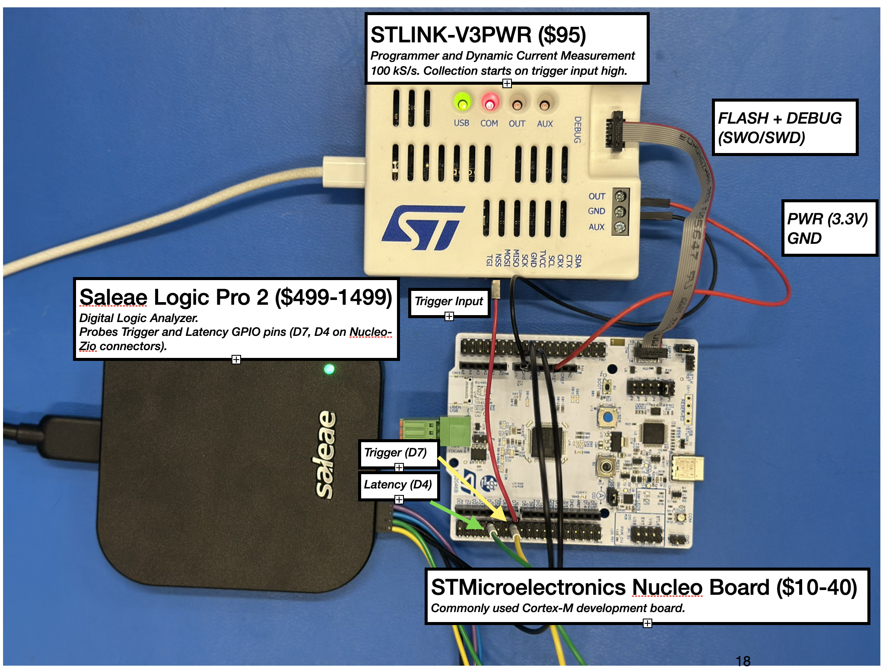
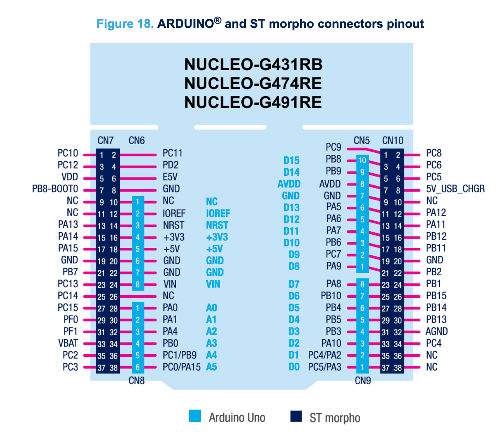
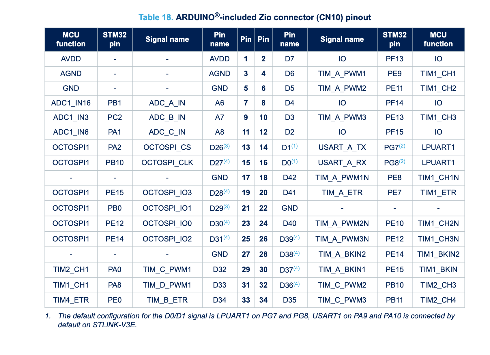

# Hardware Connection Guide

This document describes how to connect the **Saleae Logic Analyzer (LA)** and the **STLink-V3PWR** to each supported NUCLEO board for power and signal measurements.  
We assume you have the required hardware (Saleae Logic Pro or compatible, STLink-V3PWR, jumper wires).

---

## Common Setup

- **Logic Analyzer (LA):**
  - Connect to the **Arduino headers** on each NUCLEO board.
  - `D7` → LA Channel 0 (`TRIGGER`)
  - `D4` → LA Channel 1 (`LATENCY`)
  - Connect ground probes into available GND pins on NUCLEO board.

- **STLink-V3PWR:**
  - Used to power the board and capture current consumption.
  - Power Connection header varies by board (see below).
  - Use a second female-to-male jumper to connect from `TRIGGER` to the TGI pin
    on the STLink-V3PWR. 
  - Connect a MIPI14 cable to the compatible Debug header. Picture below shows an example setup.
    

⚠️ **Important:** Use the STLink-V3PWR as the *only* power source. Do not power the board simultaneously via USB 5V.

---

## 1. NUCLEO-STM32G474

- **Power:** Connect STLink-V3PWR to the **3V3 pin** on the Arduino header.  
- **Signals:**  
  - D7 → LA Channel 0 (`TRIGGER`)  
  - D4 → LA Channel 1 (`LATENCY`)  

---

## 2. NUCLEO-STM32H7A3ZIQ

- **Power:** Connect STLink-V3PWR to the **3V3 pin**.  
- **Signals:**  
  - D7 → LA Channel 0 (`TRIGGER`)  
  - D4 → LA Channel 1 (`LATENCY`)  

---

## 3. NUCLEO-STM32U575ZIQ

- **Power:** Connect STLink-V3PWR to the **IOREF pin** on the Arduino header.  
- **Signals:**  
  - D7 → LA Channel 0 (`TRIGGER`)  
  - D4 → LA Channel 1 (`LATENCY`)  

---

## Summary Table

| Board                | Power Pin | Trigger (D7) | Latency (D4) | Notes                               |
|----------------------|-----------|--------------|--------------|-------------------------------------|
| STM32G474            | 3V3       | LA Ch0       | LA Ch1       |                                     |
| STM32H7A3ZIQ         | 3V3       | LA Ch0       | LA Ch1       |                                     |
| STM32U575ZIQ         | IOREF     | LA Ch0       | LA Ch1       |                                     |

---
