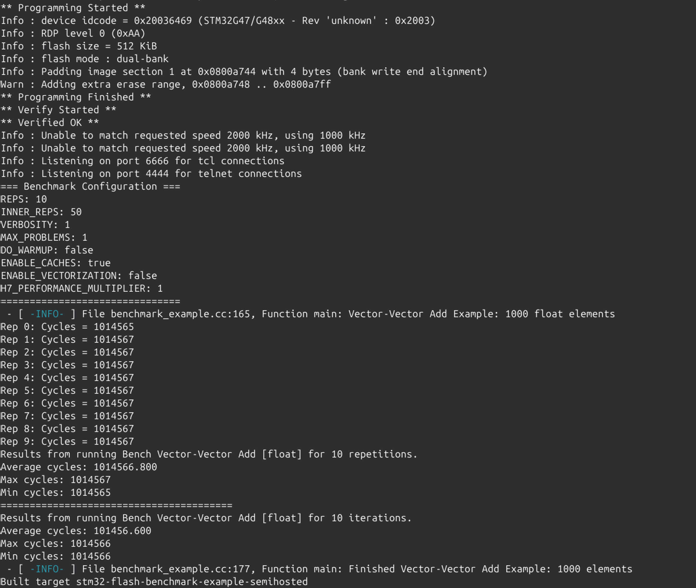
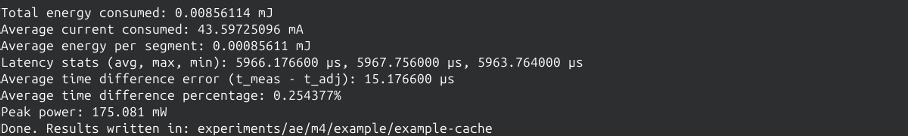
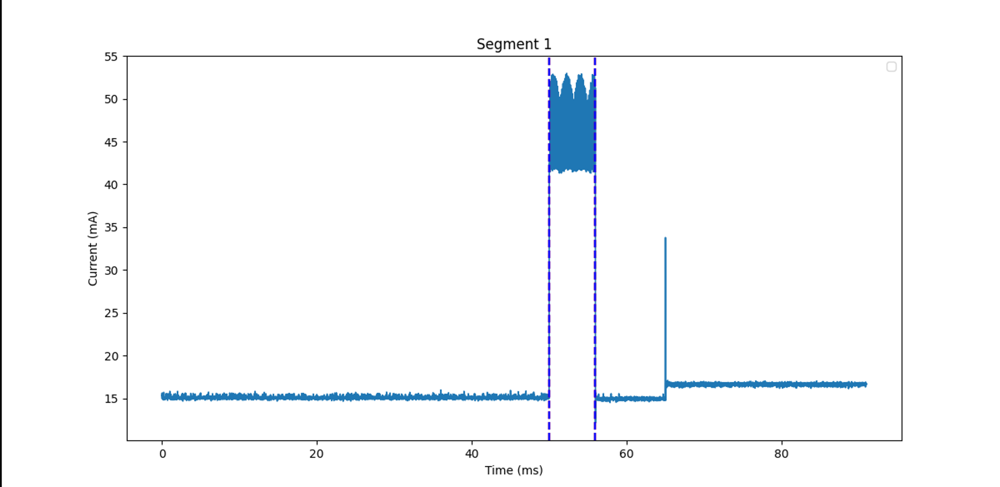

# Expected Results

This document shows example results when running the `benchmark-example` kernel
with EntoBench. Your results should be similar in scale, though minor variation
is expected.

## 1. Terminal output during benchmark execution

The harness prints out cycle counts and confirms successful execution.

## 2. Energy measurement analysis

The analysis script reports average energy (µJ), peak power (mW), and latency
(ms). These values correspond to the metrics reported in the paper.

## 3. Segment plot

Each experiment produces a segment plot under the experiment’s results folder
(e.g. `experiments/ae/m4/example/example-cache/plots/`).  
This plot visualizes the region of interest aligned with current measurements.
