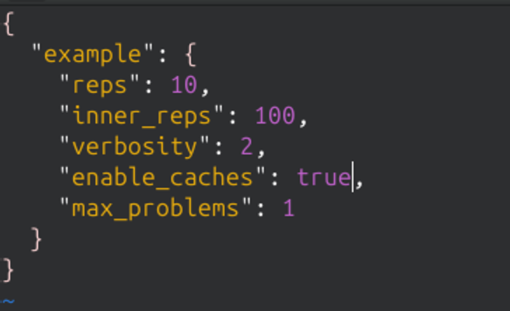

# Experiment Customization

EntoBench supports simple customization of experiment configuration files.

## 1. Edit the configuration file
Each benchmark has a JSON configuration file, e.g.:

`benchmark/configs/example_benchmarks.json`



To disable caches, change the following field:

```json
"enable_caches": true
````
to:
```json
"enable_caches": false
```

Then rerun CMake using one of our scripts to propagate the changes before rerunning the target:
```bash
./scripts/clean-and-rebuild.sh
```
